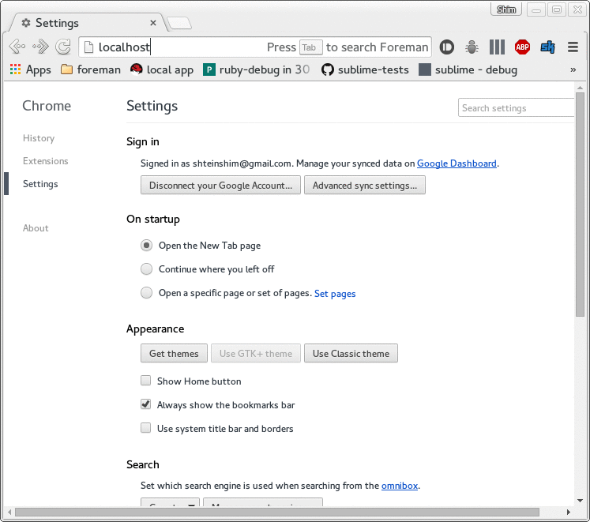

# ForemanOpensearch

This plugin adds [opensearch description document](http://www.opensearch.org/Specifications/OpenSearch/1.1#OpenSearch_description_document) declaration to foreman.

## Installation

See [How_to_Install_a_Plugin](http://projects.theforeman.org/projects/foreman/wiki/How_to_Install_a_Plugin)
for how to install Foreman plugins

## Usage

After opening any foreman page, it registers itself as a search provider automatically.
In order to search for some object enter in Chrome's omnibox: *your_foreman_servername* and then tress *TAB*.
The search string format is: *plural_object_name***:***your search query*

## Contributing

Fork and send a Pull Request. Thanks!

## TODO

* Suggestions
  1. Add suggestions for available object types: `hosts:`, `hostgroups:`, `users:` e.t.c.
  2. Link suggestions to foreman's native serch box suggestions.

## Copyright

Copyright (c) 2015 Shimon Shtein

This program is free software: you can redistribute it and/or modify
it under the terms of the GNU General Public License as published by
the Free Software Foundation, either version 3 of the License, or
(at your option) any later version.

This program is distributed in the hope that it will be useful,
but WITHOUT ANY WARRANTY; without even the implied warranty of
MERCHANTABILITY or FITNESS FOR A PARTICULAR PURPOSE.  See the
GNU General Public License for more details.

You should have received a copy of the GNU General Public License
along with this program.  If not, see <http://www.gnu.org/licenses/>.
